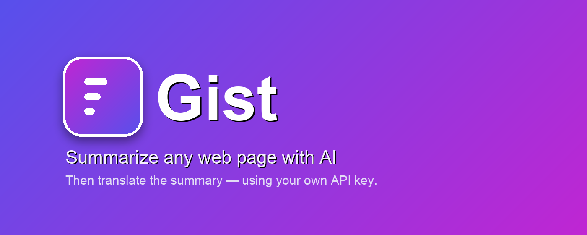
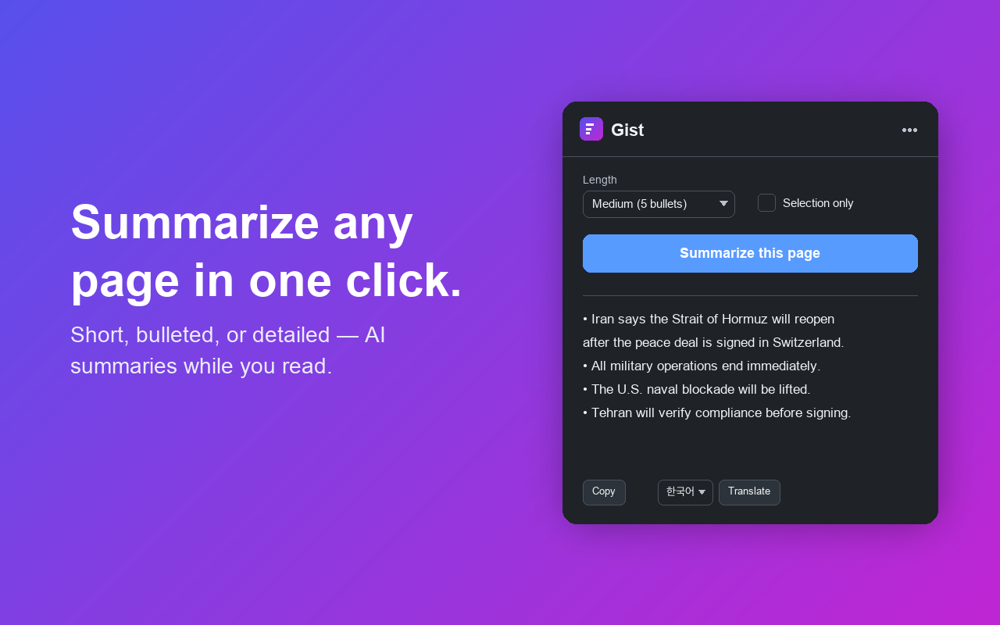
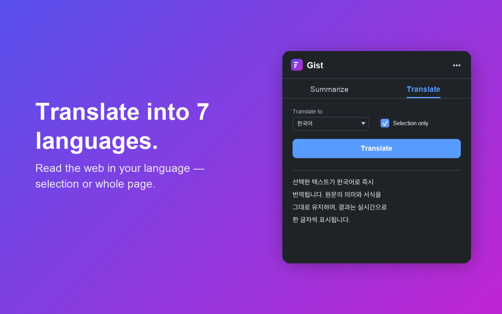
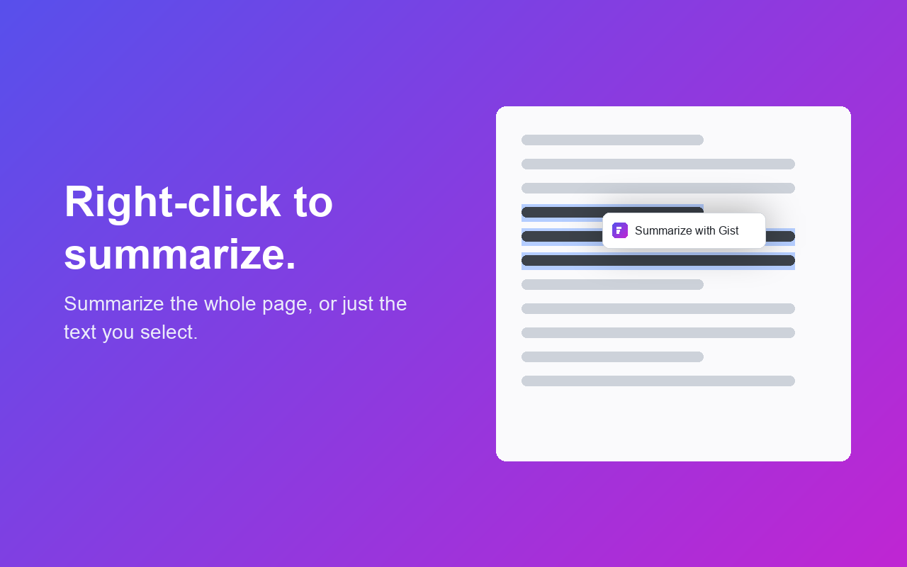
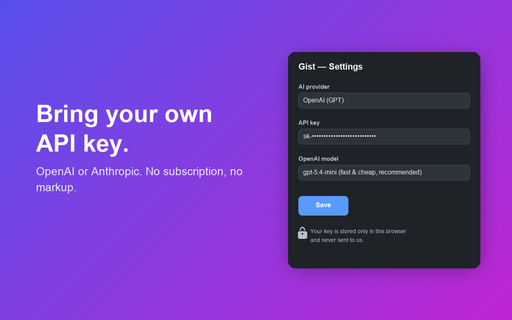
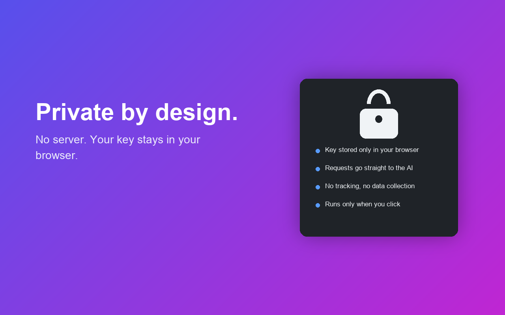

<p align="center">
  
</p>

<h1 align="center">Gist — AI Summarizer</h1>

<p align="center">
  <b>웹페이지를 한 번의 클릭으로 요약하고, 그 요약을 원하는 언어로 번역하는 크롬 확장 프로그램</b><br/>
  서버 없이 <b>사용자 본인의 OpenAI · Anthropic · Google Gemini API 키</b>로 동작합니다.
</p>

<p align="center">
  
  
  
  
  
</p>

---

## ✨ 한눈에 보기

> 긴 기사·논문·문서를 챗봇에 복붙하거나 새 탭을 열 필요 없이, **보고 있는 그 페이지에서** 바로 요약하고 번역합니다.

<table>
  <tr>
    <td width="50%" align="center">
      <br/>
      <b>📄 한 번의 클릭으로 요약</b><br/>
      <sub>짧게 · 보통(불릿) · 자세히 중 선택, 실시간 스트리밍</sub>
    </td>
    <td width="50%" align="center">
      <br/>
      <b>🌐 요약문을 내 언어로</b><br/>
      <sub>7개 언어로 번역하고 원문으로 되돌리기</sub>
    </td>
  </tr>
  <tr>
    <td width="50%" align="center">
      <br/>
      <b>🖱 우클릭 → "Gist로 요약하기"</b><br/>
      <sub>페이지 전체 또는 선택한 텍스트만</sub>
    </td>
    <td width="50%" align="center">
      <br/>
      <b>🔌 본인 API 키 사용</b><br/>
      <sub>구독·마진 없음 · GPT-5.x / Claude / Gemini 선택</sub>
    </td>
  </tr>
</table>

<p align="center">
  <br/>
  <b>🔒 프라이버시 우선</b> — 별도 서버 없음, 키는 브라우저에만 저장, 버튼을 누른 순간에만 동작
</p>

---

## 🚀 주요 기능

- 📄 **페이지 요약** — 본문을 자동 추출(가독성 휴리스틱)해 짧게 / 보통(불릿 5개) / 자세히 중 선택
- ✂️ **선택 영역 요약** — 드래그한 텍스트만 요약
- 🌐 **요약문 번역** — 완성된 요약을 영어·한국어·일본어·중국어·스페인어·프랑스어·독일어로 번역, **원문 복원** 가능
- 🖱 **우클릭 메뉴** — 페이지나 선택 영역에서 `Gist로 요약하기` 한 항목
- ⚡ **실시간 스트리밍** — 결과가 생성되는 대로 한 글자씩 표시
- 🔌 **OpenAI · Anthropic · Google Gemini 지원** — 제공자·모델 선택 + 모델 ID 직접 입력
- 🌍 **다국어 UI** — 영어 기본 + 한국어(Chrome i18n), 브라우저 언어에 따라 자동 전환
- 🔒 **프라이버시** — 별도 서버 없음, 사용자 키로 AI 제공자에 직접 요청

---

## 🧑‍💻 설치 & 시작하기 (개발자 모드)

```bash
git clone https://github.com/kwakhyun/gist.git
```

1. Chrome 주소창에 `chrome://extensions` 입력
2. 우측 상단 **개발자 모드** 켜기
3. **압축해제된 확장 프로그램을 로드합니다** → 클론한 폴더 선택
4. 툴바의 Gist 아이콘 → ⚙ 설정에서 **제공자 선택 + API 키 입력 후 저장**
5. 아무 기사 페이지에서 아이콘 클릭 → **이 페이지 요약하기** 🎉

### API 키 발급

| 제공자 | 발급 위치 | 키 형식 |
|--------|-----------|---------|
| **OpenAI** | https://platform.openai.com/api-keys | `sk-...` |
| **Anthropic** | https://console.anthropic.com/settings/keys | `sk-ant-...` |
| **Google Gemini** | https://aistudio.google.com/apikey | `AIza...` |

> 비용은 사용자 API 계정에 직접 청구되며, 기본 모델(`gpt-5.4-mini` / `Claude Haiku 4.5`)은 요약·번역에 매우 저렴합니다.

---

## 🏗 기술 구성

| 영역 | 내용 |
|------|------|
| 플랫폼 | Manifest V3, 빌드 단계 없는 순수 JavaScript (프레임워크 없음) |
| `background.js` | 서비스 워커 — 포트 기반 스트리밍으로 OpenAI/Anthropic SSE 응답 중계 |
| `popup.*` | 요약 UI + 요약문 번역. 버튼 클릭 시 `chrome.scripting`으로 **현재 탭에만** 추출 함수 실행 (상시 콘텐츠 스크립트 없음) |
| `options.*` | 제공자 · API 키 · 모델 설정 (`chrome.storage.sync`) |
| `_locales/` + `i18n.js` | Chrome i18n. `default_locale: en`, 한국어 포함. `data-i18n` 속성을 메시지로 치환 |

---

## 🔐 프라이버시

- 별도 **서버를 운영하지 않습니다.** 분석·추적·광고가 없습니다.
- API 키와 설정은 **브라우저(`chrome.storage`)에만** 저장되며 개발자에게 전송되지 않습니다.
- 요약·번역 시 텍스트는 브라우저에서 **사용자가 선택한 AI 제공자로 직접** 전송됩니다.
- 전문: [privacy.html](privacy.html) · [https://kwakhyun.github.io/gist/privacy.html](https://kwakhyun.github.io/gist/privacy.html)

---

## 📦 크롬 웹 스토어 배포

패키징 · 등록 정보 · 권한 근거 · 스크린샷은 다음을 참고하세요:

- 배포 절차: [DEPLOY.md](DEPLOY.md)
- 등록 정보(설명·요약): [store/listing.md](store/listing.md)
- 권한 근거 · 전용 목적: [store/privacy-form.md](store/privacy-form.md)
- 패키지 빌드: `./package.sh` → `build/smart-summarize-extension.zip`

---

## 📄 라이선스

[MIT](LICENSE) © kwakhyun

---

<p align="center">
  <br/>
  <sub>Made with the Gist extension · Bring your own key, keep your privacy.</sub>
</p>
